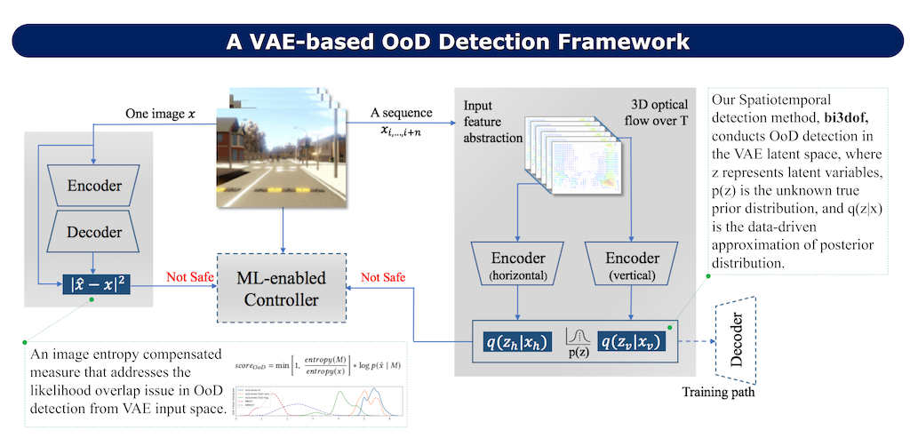

# Improving Variational Autoencoder based Out-of-Distribution Detection for Embedded Real-time Applications

This repository contains an implementation of our methods in paper (https://arxiv.org/abs/2107.11750v2) which appears as part of the ESWEEK-TECS special issue and is presented in the International Conference on Embedded Software (EMSOFT), 2021.

<p align="center"></p>


## Prerequisites
* Python 3.7+
* PyTorch 1.8+ 
* OpenCV2 fo Python (https://pypi.org/project/opencv-python/)
* HDF5 for Python (https://docs.h5py.org/en/stable/)


## Train
* A toy model
* * Run `python train_nuscenes-mini.py` to train a bi3dof model with default parameter values and an already processed scene from nuscenes-v1.0-mini.

* With nuScenes or own data sets
* * Follow the nuScenes' tutorial (https://www.nuscenes.org/nuimages#tutorials) to download the mini set. 
* * Extract the video frames and place them into a folder structure as described in feature_abstraction.py. Then run `python feature_abstraction.py` to extract features for one time. 
* * Run `python train_nuscenes-mini.py` to train. See in-script help lines for optional arguments.


## Citation

If you use our method or this code in your paper, then please cite it:
```
@article{feng2021improving,
title={Improving Variational Autoencoder based Out-of-Distribution Detection for Embedded Real-time Applications},
author={Feng, Yeli and Ng, Daniel Jun Xian and Easwaran, Arvind},
journal={arXiv preprint arXiv:2107.11750},
year={2021}
}
```
